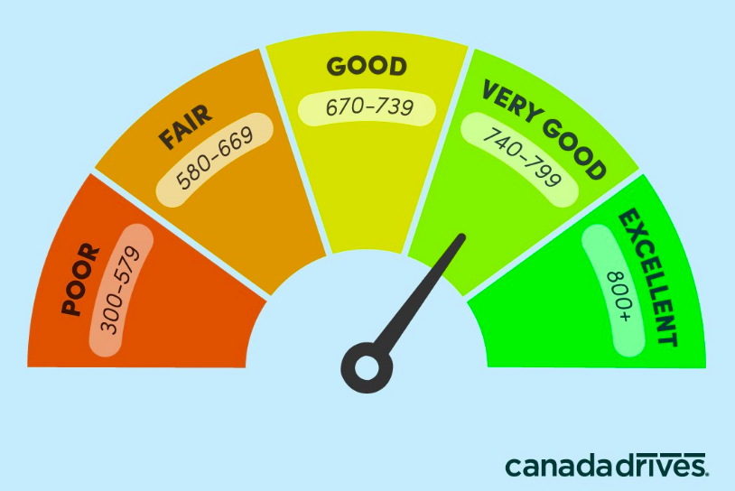
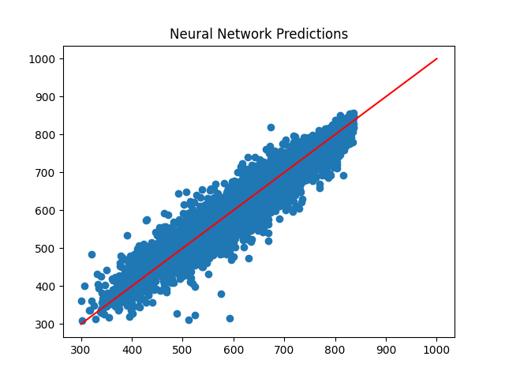
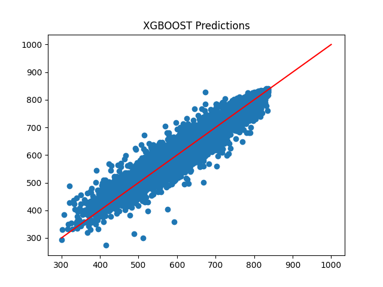

## Credit Score Overview

A credit scoring model is a mathematical model used to estimate the probability of default, which is the probability that customers may trigger a credit event (i.e. bankruptcy, obligation default, failure to pay, and cross-default events). Higher the credit score lesser the probability a customer may default.

   

## Models used

I have used 2 model for the task.

model1: FFNN

model2: XGBoost

## Results

 

